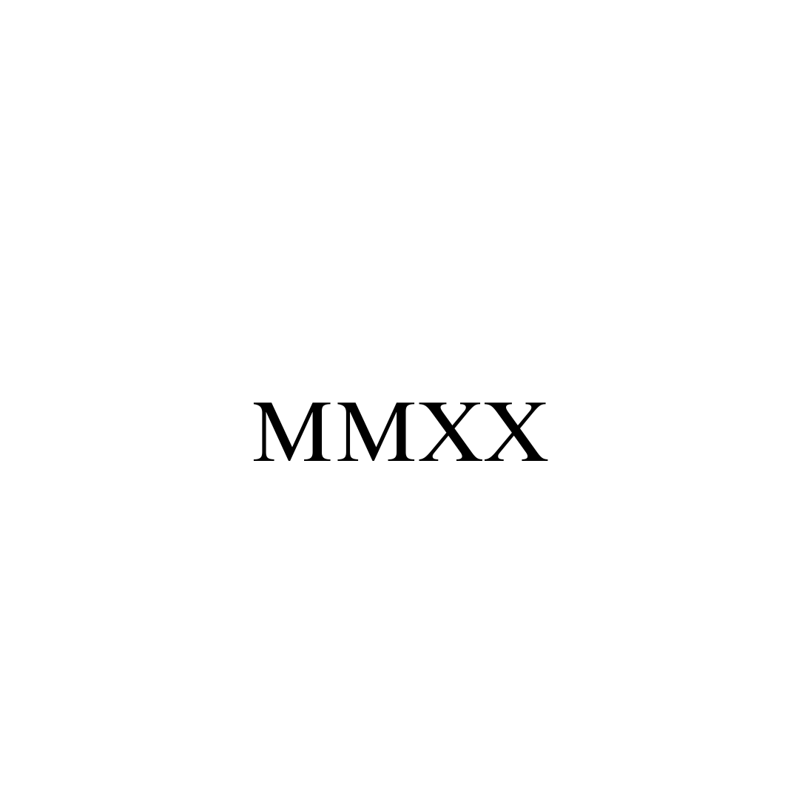

# MMXX NFT Minting DApp

A modern Next.js application for minting NFTs with multiple contract support, built with thirdweb v5 and TypeScript.



## Features

- 🚀 **Multiple Contract Support** - Mint from multiple NFT contracts with a dropdown selector
- 💳 **Wallet Integration** - Connect with MetaMask, Coinbase Wallet, and other Web3 wallets
- 🎨 **Modern UI** - Beautiful, responsive design with Tailwind CSS
- ⚡ **Next.js 14** - Latest Next.js with App Router and TypeScript
- 🔗 **thirdweb v5** - Latest thirdweb SDK for seamless Web3 integration
- 📱 **Mobile Responsive** - Works perfectly on all devices

## Quick Start

### Prerequisites

- Node.js 18+ 
- npm or yarn
- A thirdweb account ([sign up here](https://portal.thirdweb.com))

### Installation

1. **Clone the repository**
   ```bash
   git clone <your-repo-url>
   cd mmxx-nft-dapp
   ```

2. **Install dependencies**
   ```bash
   npm install
   ```

3. **Set up environment variables**
   Create a `.env.local` file in the root directory:
   ```bash
   # Get your client ID from https://portal.thirdweb.com/typescript/v5/client
   NEXT_PUBLIC_THIRDWEB_CLIENT_ID=your_thirdweb_client_id_here
   
   # Single contract (optional)
   NEXT_PUBLIC_CONTRACT_ADDRESS=0xYourContractAddress
   
   # Multiple contracts (comma-separated)
   NEXT_PUBLIC_CONTRACT_ADDRESSES=0xContract1,0xContract2
   ```

4. **Run the development server**
   ```bash
   npm run dev
   ```

5. **Open your browser**
   Navigate to [http://localhost:3000](http://localhost:3000)

## Environment Setup

### Getting Your Thirdweb Client ID

1. Go to [thirdweb Portal](https://portal.thirdweb.com/typescript/v5/client)
2. Sign up or log in to your account
3. Create a new project or select an existing one
4. Copy your Client ID
5. Add it to your `.env.local` file

### Contract Configuration

You can configure either a single contract or multiple contracts:

**Single Contract:**
```bash
NEXT_PUBLIC_CONTRACT_ADDRESS=0xYourContractAddress
```

**Multiple Contracts:**
```bash
NEXT_PUBLIC_CONTRACT_ADDRESSES=0xContract1,0xContract2,0xContract3
```

## Project Structure

```
src/
├── app/
│   ├── components/
│   │   └── WalletConnect.tsx    # Wallet connection component
│   ├── sections/
│   │   └── NFTMintSection.tsx   # Main minting interface
│   ├── client.ts                # thirdweb client configuration
│   ├── providers.tsx            # React providers setup
│   ├── navbar.tsx               # Navigation component
│   ├── layout.tsx               # Root layout
│   └── page.tsx                 # Home page
public/                          # Static assets
├── MMXX.png                     # NFT images
├── IMG_0225.png                 # Logo
└── ...
```

## Technologies Used

- **Framework:** Next.js 14 with App Router
- **Language:** TypeScript
- **Styling:** Tailwind CSS
- **Web3:** thirdweb v5 SDK
- **State Management:** TanStack Query
- **UI Components:** Custom components with Tailwind

## Available Scripts

- `npm run dev` - Start development server
- `npm run build` - Build for production
- `npm run start` - Start production server

## Deployment

### Vercel (Recommended)

1. Push your code to GitHub
2. Connect your repository to [Vercel](https://vercel.com)
3. Add your environment variables in Vercel dashboard
4. Deploy!

### Netlify

1. Build the project: `npm run build`
2. Deploy the `out` folder to Netlify
3. Add environment variables in Netlify dashboard

## Troubleshooting

### Common Issues

1. **Client-side exception on load**
   - Ensure `NEXT_PUBLIC_THIRDWEB_CLIENT_ID` is set
   - Restart your development server after adding env vars

2. **"No contract configured" error**
   - Set either `NEXT_PUBLIC_CONTRACT_ADDRESS` or `NEXT_PUBLIC_CONTRACT_ADDRESSES`
   - Make sure contract addresses are valid Ethereum addresses

3. **Wallet connection issues**
   - Ensure you have a Web3 wallet installed (MetaMask, Coinbase Wallet, etc.)
   - Check that you're on the correct network

### Getting Help

- Check the browser console for detailed error messages
- Review the [thirdweb documentation](https://portal.thirdweb.com)
- Open an issue on this repository

## Contributing

1. Fork the repository
2. Create a feature branch: `git checkout -b feature/amazing-feature`
3. Commit your changes: `git commit -m 'Add amazing feature'`
4. Push to the branch: `git push origin feature/amazing-feature`
5. Open a Pull Request

## License

This project is licensed under the MIT License - see the LICENSE file for details.

## Acknowledgments

- Built with [thirdweb](https://thirdweb.com) for Web3 functionality
- UI designed with [Tailwind CSS](https://tailwindcss.com)
- Powered by [Next.js](https://nextjs.org)# mmxxV2
# mmxxV2
# mmxxV3
